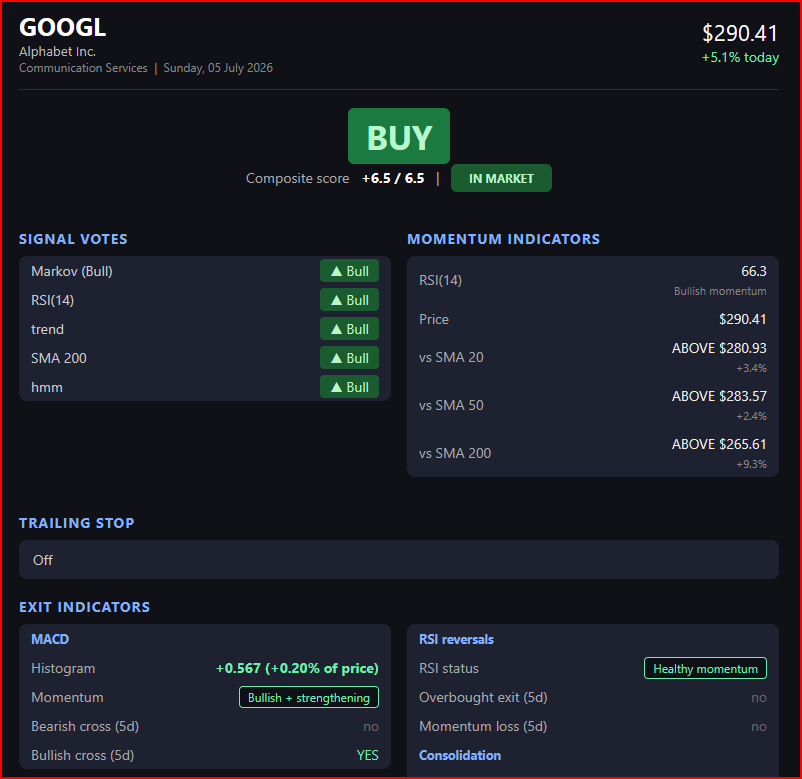
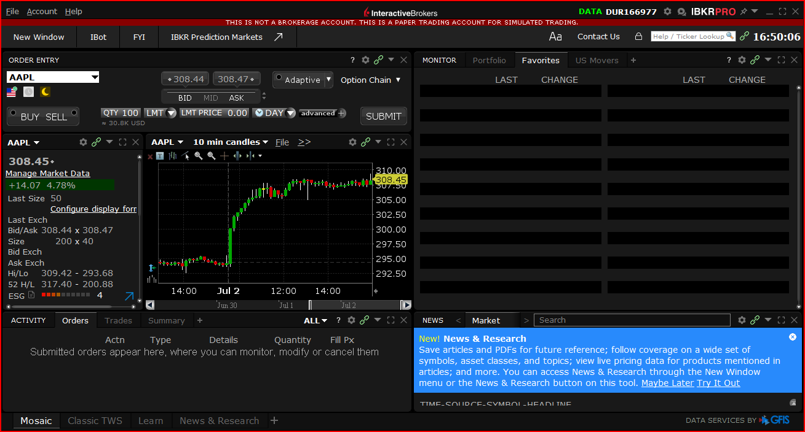

# Strategy Auto-Trader

An hourly-bar algorithmic trading system built as a [Claude Code skill](https://code.claude.com/docs/en/skills). It combines a Gaussian Hidden Markov Model regime filter with a weighted momentum vote system, a quality gate, and a layered exit stack — then backtests, live-simulates, emails trade alerts, and (optionally) executes on Interactive Brokers paper trading. Easy to design, code and backtest a new trading strategy using claude code.

> ⚠️ **Not financial advice.** This is a research and paper-trading project. Backtests use walk-forward, no-lookahead signals, but past performance predicts nothing. Use the backtests to understand *when* the system would be in or out of the market, not to forecast returns.

## What it does

- **Regime detection** — 3-state Gaussian HMM on hourly log returns, forward-filtered (strictly causal, no lookahead), with `P(Bull)` smoothing.
- **Composite entry signal** — weighted votes from the HMM regime, RSI, SMA20/50 trend, SMA200 gate, and volume ratio, with a quality gate that vetoes weak BUYs.
- **Layered exits** — hard stop-loss → take-profit → vol-scaled/trailing stop (with profit-scaled tightening) → max-hold → Parabolic SAR → MACD/RSI/consolidation exits → composite SELL.
- **Pluggable strategies** — `default`, `conservative`, `trend`, and `optimised` entry/exit pairs, selected via `--strategy` and registered in [registry.py](Strategy_Auto_Trader/strategy/base/registry.py).
- **Kelly position sizing** from trailing realised trade P&L (capped 25%, floored 2%).
- **Email alerts** — BUY/SELL trade alerts with an embedded chart and a daily roundup, via SMTP.
- **IBKR execution** — a separate execution engine reads the latest signals and places paper-trading orders through TWS, plus a continuously running daemon with overnight screening and daily trade limits.

Full detail on every option, output file, and email rule lives in **[USERGUIDE.md](USERGUIDE.md)**.

## Quick start

Requires Python 3.12+ and [uv](https://docs.astral.sh/uv/). Market data comes from yfinance — no API key needed for backtesting.

```bash
git clone https://github.com/craigwhughes-dev/Strategy_Auto_Trader.git
cd Strategy_Auto_Trader
uv sync

# Backtest SPY with default settings (hourly bars, ~2 years of history)
uv run python -m Strategy_Auto_Trader.markov_cli.run --ticker SPY

# Try a different strategy and tighter stops
uv run python -m Strategy_Auto_Trader.markov_cli.run --ticker TSLA --strategy conservative --stop-loss-pct 0.03 --no-kelly
```

Each run writes a timestamped directory under `data/` containing the input data, per-bar backtest CSV, a four-panel chart, and a self-contained HTML daily summary — see [USERGUIDE.md](USERGUIDE.md#output-files) for the full list.

### Other entry points

| Command | Purpose |
|---------|---------|
| `... markov_cli.run --ticker SPY` | Single-ticker backtest + daily summary |
| `... markov_cli.batch` | Run the whole watchlist, send email alerts |
| `... markov_cli.screen` | Fast screen of the S&P 500 + FTSE 100 universe |
| `... markov_cli.live_sim --tickers SPY,TSLA` | Multi-ticker live simulation, compare strategies side by side |
| `... markov_cli.execute --dry-run` | Read latest signals, print the orders that *would* be placed |
| `... markov_cli.execute` | Place paper orders via IBKR TWS (port 7497) |
| `... markov_cli.live_daemon` | Continuous hourly trading loop with overnight screening |

(All invoked as `uv run python -m Strategy_Auto_Trader.<module>`.) IBKR setup — TWS configuration, capital pot, position limits — is covered in [USERGUIDE.md](USERGUIDE.md#ibkr-paper-trading-execution-engine); daemon deployment (Windows Task Scheduler) in [README_DAEMON.md](README_DAEMON.md).

## Driving it with Claude Code

This repo doubles as a Claude Code skill: open it in Claude Code and drive the whole workflow conversationally. Some prompts that work well:

**Backtesting and analysis**

- *"Backtest NVDA with the trend strategy and show me the exit-reason breakdown. Why did most trades close?"*
- *"Run the backtest on SPY and on QQQ with identical settings and tell me which one the strategy handles better, and why."*
- *"Compare the default, conservative, and optimised strategies on TSLA over the last two years — which had the best Sharpe and fewest whipsaws?"*
- *"Run the screener and then a full backtest on the top three winners."*
- *"ASTS keeps getting stopped out early. Suggest and test better vol-stop and min-hold settings for a ~90% annualised vol stock."*

**Understanding the system**

- *"Walk me through exactly why the strategy sold ASTS on the last SELL event — which exit fired and what were the votes that day?"*
- *"Explain how the quality gate vetoed BUYs in my last SPY run and whether it helped or hurt P&L."*
- *"What would change in the last backtest if Kelly sizing were disabled? Run both and diff the equity curves."*

**Extending it**

- *"Add a new strategy called 'aggressive' to the registry: looser entry threshold, no SMA200 gate, tighter take-profit. Backtest it against 'default' on my watchlist and write tests for it."*
- *"Add a maximum-drawdown circuit breaker to the exit stack and unit-test its boundary conditions."*
- *"Add three FTSE tickers to the watchlist with a per-ticker sell threshold of -2."*

**Operations**

- *"Run the batch for the FTSE watchlist but skip emails, then summarise the roundup for me here."*
- *"Do a dry-run of the execution engine and tell me what orders it would place and why."*
- *"Check the daemon log and execution state — did it trade today, and are the open positions consistent with the signals?"*

**Auto trading daemon**
- *"start the daemon for ftse100. use the optimised strategy. unlimited buy and sell. 10k original stake. record all results in a clean journal. use ibkr for paper trades"*

## Testing

```bash
uv run pytest tests/ -q
```

The suite covers the exit stack, indicators, composite signal weights, the quality gate, HMM forward filtering, the consolidated engine, the broker layer (sizing, capacity, daily limits, staleness guards), email/state handling, and the daemon's screening and scheduling logic.

## Project layout

```
Strategy_Auto_Trader/
  core/          # Indicators, quality gate, exit logic
  strategy/      # Strategy registry + default/conservative/trend/optimised
  plugins/       # Pluggable sizers, gates, adjusters, exit rules
  quant_hmm/     # HMM engine, consolidated walk-forward backtest, sentiment, vol screen
  markov_cli/    # CLI entry points (run, batch, screen, live_sim, execute, live_daemon)
  broker/        # IBKR adapter, NullBroker, portfolio manager, signal reader
  extensions/    # Multi-seed HMM with forward filter
  output/        # HTML report, chart, emailer, trade state, journal
config/          # Watchlists and daemon config
tests/           # pytest suite (mirrors the package structure)
```

## Documentation

- **[USERGUIDE.md](USERGUIDE.md)** — every CLI option, signal weighting, exit rule, output file, watchlist format, email setup, and IBKR configuration
- **[README_DAEMON.md](README_DAEMON.md)** — deploying the continuous trading daemon on Windows Task Scheduler
- **[TASK_SCHEDULER_SETUP.md](TASK_SCHEDULER_SETUP.md)** — scheduled batch runs after LSE/NYSE close

## Example email

Trade alerts arrive as a self-contained HTML email per ticker: the signal (BUY/SELL/HOLD) with the composite score, the individual signal votes behind it, momentum indicators, trailing-stop status, and the exit-indicator panel (MACD and RSI-reversal state). A BUY alert looks like this:



The daily roundup email is a companion summary: one row per watchlist ticker showing its current signal (with any trade event highlighted), close price, composite score, P&L, and strategy return versus buy-and-hold.

## IBKR paper trading

When the daemon runs with dry-run disabled, orders route to Interactive Brokers TWS (paper account) and appear in the TWS Mosaic view:



## Complete Metrics Reference

### Risk/Return Metrics
Backtest engine, computed for Strategy and Buy & Hold (source: `quant_engine.py`)

| Metric | Formula | Notes |
|--------|---------|-------|
| Sharpe (annualised) | `mean(returns) / std(returns) × √1700` | Risk-adjusted return |
| Sortino (annualised) | `mean(returns) / downside_dev × √1700` | Downside risk only |
| Calmar | `annualised_return / \|max_drawdown\|` | Return per unit max loss |
| Total Return | `(final_equity − 1) × 100%` | End-to-end P&L % |
| Max Drawdown | Worst peak-to-trough on equity curve | Maximum loss from peak |
| Kelly Fraction | `(win_rate × b − loss_rate) / b` | Position sizing (capped 25%) |
| Information Ratio | `mean(strat − bh) / std(strat − bh) × √1700` | Consistency of outperformance vs buy & hold |
| Up Capture | Compounded strategy return / benchmark return on up bars | >1 = gains more than the market when it rises |
| Down Capture | Same, on down bars | <1 = loses less when the market falls (0 = fully sidestepped) |

### Trade-Level Metrics
Per-trade and aggregate statistics (reported in `quant_run.py`, `quant_trade_report.py`, console summaries, and HTML backtest report)

| Metric | Description |
|--------|-------------|
| Trade count | Total buys, sells, and open positions |
| Win rate % | Closed winners / (winners + losers) × 100 |
| Avg win % | Mean return on winning trades |
| Avg loss % | Mean return on losing trades |
| Profit factor | Sum of wins / sum of losses |
| Avg P&L per trade | Total P&L / trade count |
| Avg hours held | Mean duration of closed trades |
| Total P&L (£) | Cash P&L after transaction costs |
| Final portfolio value (£) | Starting capital + P&L |
| Transaction costs (£) | Sum of trade costs |
| Days in market | Active trading days / total window days |

### Journal Analysis (A1–A12)
Live-sim and backtest trade journal breakdown (source: `analyze_journal.py`)

| Analysis | Measures |
|----------|----------|
| A1: Per-strategy outcomes | n, hit_rate, avg_ret, med_ret, profit_factor, total_pnl, avg_days |
| A2–A5: Bucketed by signal | Entry score / RSI / regime / volume — same stats as A1 per bucket |
| A6: Exit-reason breakdown | Count of exits by reason (regime, stop-loss, take-profit) |
| A7: Forward returns | % return of the market after our exit (did we sell too early?) |
| A8: Days-held distribution | Histogram of trade durations |
| A9: Concentration | % of P&L from top-N tickers, Herfindahl index; sector concentration (P&L and trade share by sector, sector Herfindahl, unintended-sector-bet warning) |
| A10: Capital efficiency | Recovered notional per trade, dollar-days of exposure, avg deployed capital, peak concurrent exposure, return per dollar-year deployed (annualised), annualised buy-and-hold equal-weight benchmark |
| A11: MFE/MAE excursions | Max favorable / adverse excursion per trade (from peak_gain/peak_loss); winners' MAE percentiles (stop placement), losers' give-back share (trailing-stop tuning), edge ratio (avg MFE / avg \|MAE\|) |
| A12: Market-adjusted P&L | Trade return minus the market's move during the same hold window (MAP); % of trades beating the market, by strategy and exit reason — separates stock-picking from market beta |

### Trend/Regime Quality
Market micro-structure metrics (source: `vol_screen.py`)

| Metric | Description |
|--------|-------------|
| Annualised volatility | Daily returns std × √252 |
| Kaufman Efficiency Ratio | Net move / total path length (0–1, higher = more trending) |
| Lag-1 autocorrelation | Return serial dependence (positive = momentum, negative = mean-reverting) |
| Choppiness Index (14-day avg) | 0–100, higher = choppier / less trendy |
| Sign-change frequency | % of days where return sign flips vs prior day |
| Trend quality (composite) | Weighted score: `1.5 × (ER − 0.07)/0.05 + autocorr + …` (higher = better for HMM) |

*Reported in: per-ticker summary columns in `quant_trade_report.py`*

### Market Sentiment
Per-ticker sentiment inputs and composite score (source: `sentiment.py`)

#### Options IV
| Metric | Signal | Notes |
|--------|--------|-------|
| iv_rank | — | Current IV as percentile vs 1-year range (0–100) |
| iv_current | — | Median IV across calls and puts |
| iv_signal | +1, 0, −1 | Low IV = cheap entry, high IV = risky |
| put_call_ratio | — | Put OI / call OI |
| put_call_signal | +1, 0, −1 | Contrarian: high P/C >1.2 bullish, <0.5 bearish |
| skew | — | OTM put IV − OTM call IV (positive = fear) |

#### VIX
| Metric | Signal | Notes |
|--------|--------|-------|
| vix_current | — | Current level |
| vix_sma20 | — | 20-day moving average |
| vix_regime | — | "low_vol", "normal", "high_vol", "crisis" |
| vix_signal | +1, 0, −1 | Low vol safe, high vol caution |
| vix_term_structure | — | "contango" or "backwardation" |

#### Insider Activity
| Metric | Signal | Notes |
|--------|--------|-------|
| insider_buys_90d | — | Count in last 90 days |
| insider_sells_90d | — | Count in last 90 days |
| insider_net | — | Buys − sells |
| insider_signal | +1, 0, −1 | Net buying (≥2) bullish, selling (≥3) bearish |
| insider_total_value | — | Notional of recent transactions |

#### Short Interest
| Metric | Signal | Notes |
|--------|--------|-------|
| short_pct_float | — | % of float shorted |
| short_ratio | — | Days to cover |
| short_signal | +1, 0 | >10% squeeze potential |

#### Composite Score
| Metric | Notes |
|--------|-------|
| sentiment_score | Weighted −1 to +1 (options 1.5×, insider 2.0×, VIX 1.0×, short 0.5×) |
| sentiment_label | "bullish" (>0.3), "neutral" (±0.3), "bearish" (<−0.3) |
| confidence | Count of data sources (0–4) |

*Reported in: per-trade detail, per-ticker summary, and HTML report (`quant_trade_report.py`); also fed into the engine to adjust entry/exit thresholds (`quant_engine.py`)*

### Execution Quality
IBKR execution path (source: `broker/portfolio.py`, logged per order in `state/execution_state.json` and the daemon log)

| Metric | Description |
|--------|-------------|
| Slippage (bps) | `(fill − signal close) / signal close × 10,000`, sign-adjusted so positive = worse than the signal price for both BUYs and SELLs |

### Metrics by Output Location
Where each metric appears in the report outputs

| Output | Metrics Shown |
|--------|---------------|
| Console backtest summary | Risk/return (all 8, incl. IR and up/down capture), trade stats, days in market |
| HTML backtest report | Risk/return + Kelly, trade counts, P&L, txn costs |
| Per-ticker summary (A1+journal) | Risk/return, trade stats, profit factor, trend quality, efficiency ratio, sentiment labels |
| Strategy comparison table | Risk/return, trade counts, win rate, avg win/loss, profit factor |
| Backtest chart legend | Sharpe, Sortino vs B&H |
| Live journal analysis | A1–A12: everything above except risk/return ratios (only raw P&L) |
| Execution log / state | Fill price, signal price, slippage bps per order |
